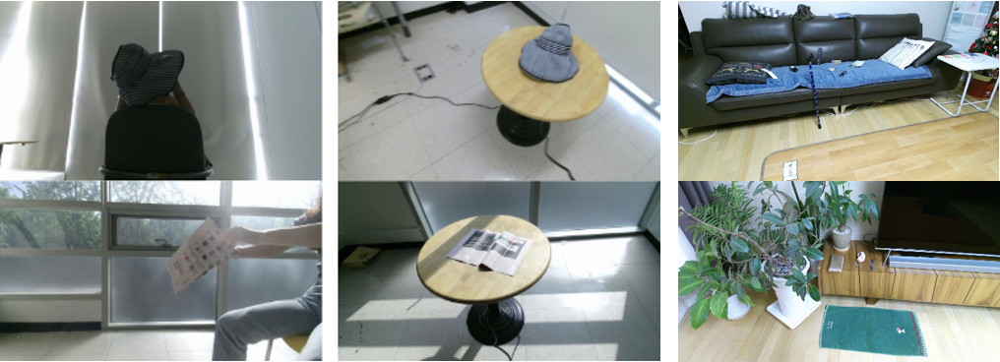

# AIR Project Elderly Object Instance Dataset
> 본 데이터셋은 [AIR과제](https://ai4robot.github.io/)의 일환으로 수집되었으며, 물체의 인스턴스 인식 기술의 학습 및 평가를 위한 것으로, 특히 고령자들이 자주 잃어버리고 찾는 물건들을 대상으로 함.

## 수집과정
* 53명의 69세 이상 고령자들을 대상으로 관찰조사를 하여 자주 이용하고, 소지하고, 찾았던 소지품 15종을 데이터셋의 대상으로 선정함.
* 추가적으로 가정에 공통적으로 존재하는 대형물체 5종을 추가 선정하여 수집함.
* 소지품의 경우 3가지 환경에서, 대형물체의 경우 2가지 환경에서 촬영함.
* Kinect v2를 이용하여 1920x1080 RGB-D로 촬영함.

## 공개 내용
### 대상 물체
* 소지품 15종: 안경, 핸드폰, 리모컨, 약봉지, 약통, 컵, 신문, 담배, 모자, 지팡이, 수건, 양말, 지갑, 필기구, 열쇠
* 대형물체 5종: TV, 냉장고, 선풍기, 침구, 소파
 

### 수집 유형 및 규모
* [x] 손에 들고 돌려가며 촬영, 물체당 약500장
* [x] 테이블에 두고 주위를 돌아가며 촬영, 물체당 약500장
* [ ] 집안에 여러 물체를 두고 촬영 (추후 공개 예정)
 

### 데이터 형식
* [x] color 1920x1080 pixels
* [ ] depth (추후 공개 예정)
* [x] annotation정보 (category name, instance id, boundingbox)

### 디렉토리 구조
* PASCAL VOC 데이터셋의 구조를 따름
    .    
    ├── Annotations
    ├── ImageSets
    ├── Images
    ├── Utils
    └── README.md

## 다운로드 방법
* [담당자](yochin@etri.re.kr)에게 메일을 보내 요청

## Acknowledgements
>> This dataset is supported by the ICT R&D program of MSIP/IITP. [2017-0-00162, Development of Human-care Robot Technology for Aging Society]
