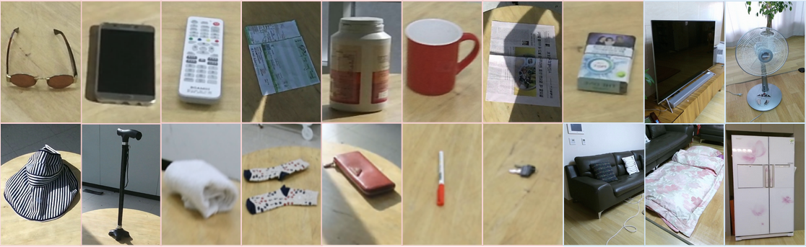
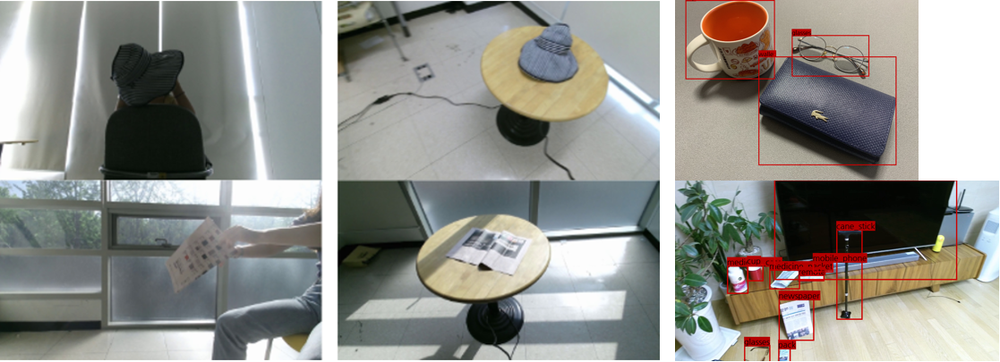

# AIR Project Elderly Object Instance Dataset
> 본 데이터셋은 [AIR과제](https://ai4robot.github.io/)의 일환으로 수집함.
> 고령자들이 자주 잃어버리고 찾는 물건들을 주 대상으로 함.
> 물체 검출 및 인스턴스 인식 기술의 학습 및 평가를 위한 것임.

## 수집과정
* 53명의 69세 이상 고령자들을 대상으로 관찰조사를 하여 자주 이용하고, 소지하고, 찾았던 소지품 15종을 데이터셋의 대상으로 선정함.
* 추가적으로 가정에 공통적으로 존재하는 대형물체 5종을 선정하여 수집함.
* 등록을 위해 소지품의 경우 2가지 환경에서 촬영함.
* 테스트를 위해 소지품과 대형물체들을 집안에 두고 촬영함.
* 직접 촬영한 영상은 Kinect v2를 이용하여 1920x1080 RGB-D로 촬영함.
* 추가 학습 및 테스트를 위해, 공개 데이터셋([Open Images](https://storage.googleapis.com/openimages/web/index.html), [VisualGenome](https://visualgenome.org/))에서 해당 물체들이 포함된 이미지를 추출하고, 빠진 물체들은 추가태깅함.

## 공개 내용
### 대상 물체
* 소지품 15종: 안경, 핸드폰, 리모컨, 약봉지, 약통, 컵, 신문, 담배, 모자, 지팡이, 수건, 양말, 지갑, 필기구, 열쇠
* 대형물체 5종: TV, 냉장고, 선풍기, 침구(침대), 소파
 

### 수집 유형 및 규모
* [x] 1) 손에 들고 돌려가며 촬영, 물체당 약500장
* [x] 2) 테이블에 두고 주위를 돌아가며 촬영, 물체당 약500장
* [x] 3) 집안에 여러 물체를 두고 원거리 촬영, 124장
* [x] 4) 집안에 여러 물체를 두고 근거리 촬영, 800장
* [x] 5) 공개 데이터셋에 20종의 물체 이미지 추출 및 추가 태깅, 1,806장
 

### 데이터 형식 (1, 2, 3 유형에 한해)
* [x] color 1920x1080 pixels
* [x] depth
* [x] annotation정보 (category name, instance id, boundingbox)

### 디렉토리 구조
* PASCAL VOC 데이터셋의 구조를 따름

## 다운로드 방법
* [담당자](yochin@etri.re.kr)에게 메일을 보내 요청

## Acknowledgements
> This dataset is supported by the ICT R&D program of MSIP/IITP. [2017-0-00162, Development of Human-care Robot Technology for Aging Society]
